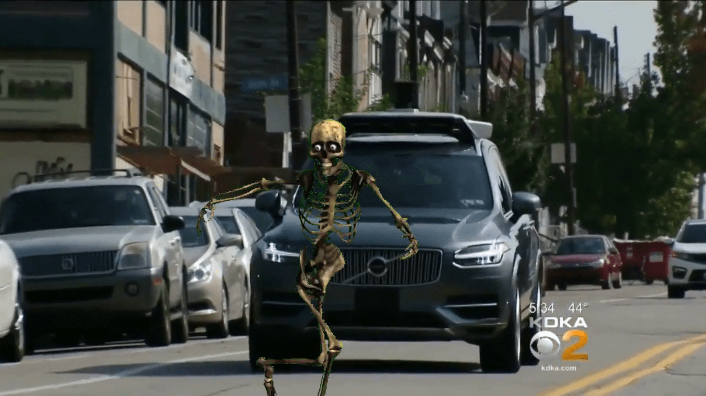
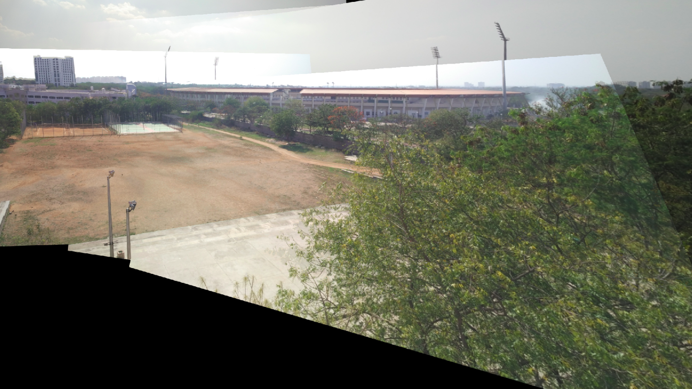
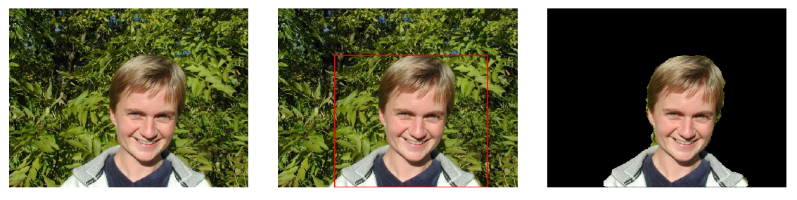
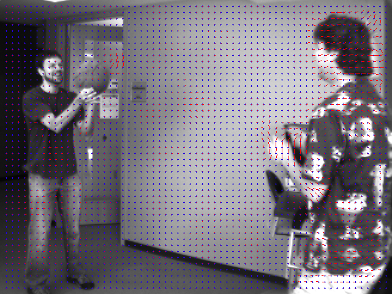

# CSE578 Computer Vision

Course offered at IIIT Hyderabad during the spring semester of 2019.

#### Course instructors:
Dr. Anoop Namboodiri 
Dr. Avinash Sharma

### Content

#### [Assignment 0 - Chroma Keying](./assignment-0)

  

#### [Assignment 1 - Camera Calibration](./assignment-1)

  

#### [Assignment 2 - Image Mosaicing](./assignment-2)

  

#### [Assignment 3 - Stereo Matching](./assignment-3)

  

#### [Assignment 4 - Grabcut](./assignment-4)

  

#### [Assignment 5 - Optical Flow](./assignment-5)

  

#### Requirements
- OpenCV
